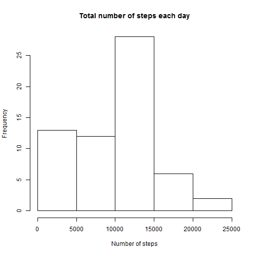
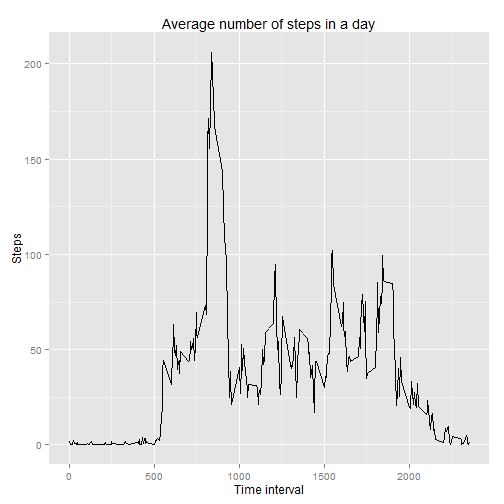
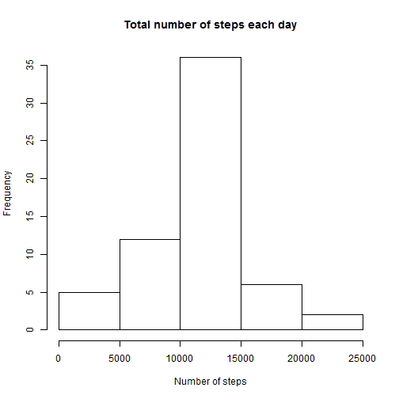
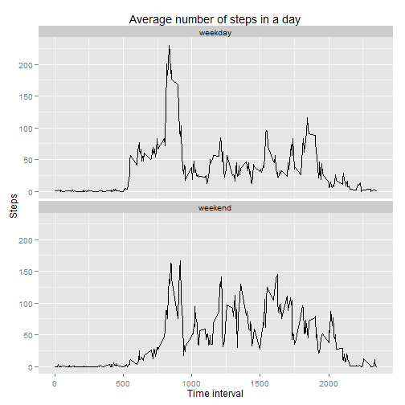

# Reproducible Research: Peer Assessment 1  


## Loading and preprocessing the data
Assuming that the data and scripts are already in the working directory, the following code will unzip the activity data and load it.


```r
unzip('activity.zip')
data <- read.csv('activity.csv', stringsAsFactors = FALSE)
```

We also need to load the libraries that we'll need to manipulate the data and build the plots.


```r
require(plyr)
require(ggplot2)
```

## What is mean total number of steps taken per day?

Make a histogram of the total number of steps taken each day


```r
# Histogram of number of steps taken each day
dailyData <- ddply(data, 'date', summarise, steps = sum(steps, na.rm = TRUE))
hist(dailyData$steps, main = 'Total number of steps each day', 
	xlab = 'Number of steps')
```

 

Calculate and report the **mean** and **median** total number of steps taken per day.


```r
# Mean steps taken each day
mean(dailyData$steps)
```

```
## [1] 9354
```

```r
# Median steps taken each day
median(dailyData$steps)
```

```
## [1] 10395
```

## What is the average daily activity pattern?

Make a time series plot of the 5-minute interval (x-axis) and the average number of steps taken, averaged across all days (y-axis)


```r
# Average steps taken across all days
averageData <- ddply(data, 'interval', summarise, 
	steps = mean(steps, na.rm = TRUE))
qplot(interval, steps, data = averageData, geom = 'line', 
	xlab = 'Time interval', ylab = 'Steps', 
	main = 'Average number of steps in a day')
```

 

Which 5-minute interval, on average across all the days in the dataset, contains the maximum number of steps?  

The interval with the maximum number of steps is


```r
# Interval with maximum number of steps
(maxIntervalPosition <- which.max(averageData$steps))
```

```
## [1] 104
```

and this interval corresponds to the time


```r
# Time interval with maximum number of steps
averageData$interval[maxIntervalPosition]
```

```
## [1] 835
```

which is equivalent to `8:35 AM`.


## Imputing missing values

Calculate and report the total number of missing values in the dataset (i.e. the total number of rows with `NA`s)


```r
# Total number of rows with NAs
rowsWithNA <- which(complete.cases(data) == FALSE)
length(rowsWithNA)
```

```
## [1] 2304
```

Devise a strategy for filling in all of the missing values in the dataset. The strategy does not need to be sophisticated. For example, you could use the mean/median for that day, or the mean for that 5-minute interval, etc.


```r
# Intervals with missing values
missingIntervals <- data$interval[rowsWithNA]

# Average step values for missing intervals
averageSteps <- with(averageData, steps[match(missingIntervals,interval)])
```

Create a new dataset that is equal to the original dataset but with the missing data filled in.


```r
# Fill NAs with average data
filledData <- data
filledData$steps[rowsWithNA] <- averageSteps
```

Make a histogram of the total number of steps taken each day and calculate and report the mean and median total number of steps taken per day. Do these values differ from the estimates from the first part of the assignment? What is the impact of imputing missing data on the estimates of the total daily number of steps?


```r
# Histogram of number of steps taken each day
newDailyData <- ddply(filledData, 'date', summarise, steps = sum(steps))
hist(newDailyData$steps, main = 'Total number of steps each day', 
	xlab = 'Number of steps')
```

 

```r
# Mean steps taken each day
mean(newDailyData$steps)
```

```
## [1] 10766
```

```r
# Median steps taken each day
median(newDailyData$steps)
```

```
## [1] 10766
```

As we can see, the new mean and median have the same value (10766), and both are larger than their previous values (mean = 9354, median = 10395). So, imputing missing data with the mean value increases the mean and median values of total daily number of steps.

## Are there differences in activity patterns between weekdays and weekends?

Create a new factor variable in the dataset with two levels - "weekday" and "weekend" indicating whether a given date is a weekday or weekend day.


```r
## Create the column 'day' to indicate whether a date is a 'weekday' or part of the 'weekend'
day <- weekdays(as.Date(filledData$date))
isWeekend <- day %in% c('Saturday', 'Sunday')
filledData$day <- ifelse(isWeekend, 'weekend', 'weekday')
```

Make a panel plot containing a time series plot of the 5-minute interval (x-axis) and the average number of steps taken, averaged across all weekday days or weekend days (y-axis).


```r
# Plot filled average data
filledAverageData <- ddply(filledData, c('interval', 'day'), summarise, steps = mean(steps))
qplot(interval, steps, data = filledAverageData, geom = 'line', 
	xlab = 'Time interval', ylab = 'Steps', 
	main = 'Average number of steps in a day') + 
facet_wrap(~ day, ncol = 1)
```

 

There's more activity between 5AM and 9:30AM in the weekdays than in the weekend. However, after 10AM, there's less activity in a weekday than in the weekend.  

This can be explained because, during the week, people wake up early to get ready for work, then they have to go to work. This happens in the window of 5AM to 9:30AM. However, once at work, there's not much activity. On the other hand, during the weekend most people don't wake up early, and don't have to get to work; however, once they're up, they are pretty active during the day.
